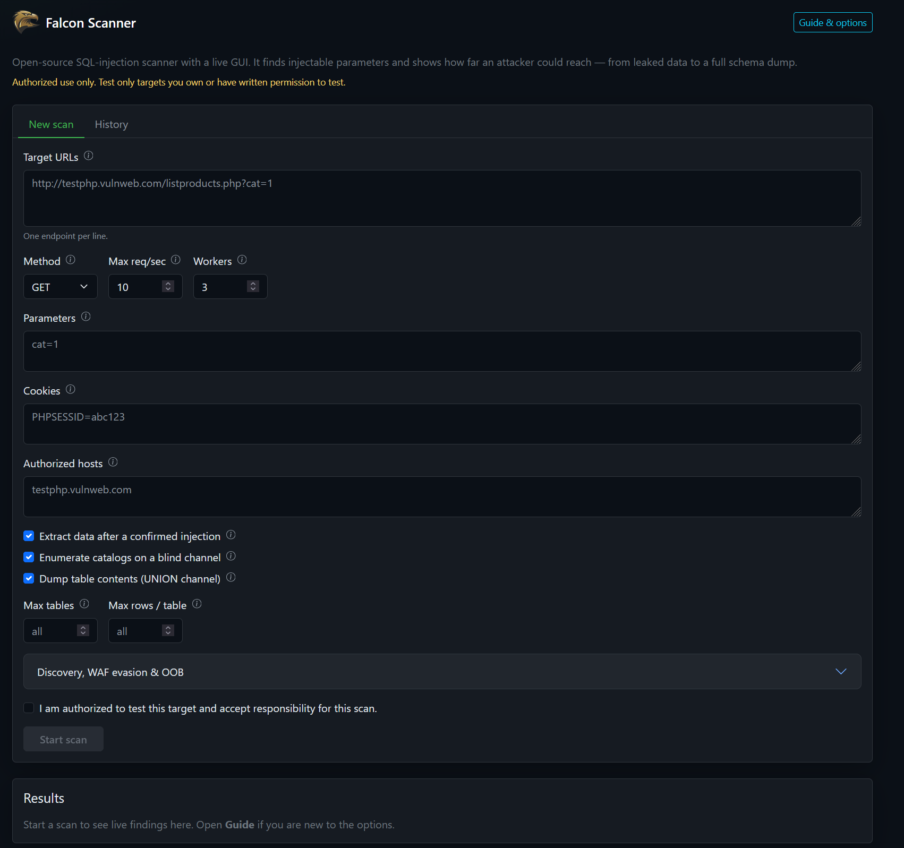

```
   .-'-.
  /     \          _____     _                    ____
 |  o o  |        |  ___|_ _| | ___ ___  _ __    / ___|  ___ __ _ _ __  _ __   ___ _ __
  \  ^  /         | |_ / _` | |/ __/ _ \| '_ \   \___ \ / __/ _` | '_ \| '_ \ / _ \ '__|
  /|   |\         |  _| (_| | | (_| (_) | | | |   ___) | (_| (_| | | | | | | |  __/ |
 (_|   |_)        |_|  \__,_|_|\___\___/|_| |_|  |____/ \___\__,_|_| |_|_| |_|\___|_|
```

Falcon Scanner is an open-source penetration-testing tool that automatically
uncovers and safely exploits SQL injection weaknesses in web applications —
revealing how far an attacker could reach, from leaking sensitive data to fully
compromising the database server. It ships with a web GUI and is modeled on the
architecture of [sqlmap](https://github.com/sqlmapproject/sqlmap). It splits
cleanly into three layers:

- **Engine** — a UI-independent Python core that does the actual detection.
- **API** — a thin [FastAPI](https://fastapi.tiangolo.com/) service (REST + WebSocket) over the engine.
- **GUI** — a [Vue 3](https://vuejs.org/) + [Vite](https://vitejs.dev/) frontend that is just a client of the API.

A command-line frontend (`cli.py`) drives the same engine, so the CLI and the
web GUI always share identical detection logic.

> ⚠️ **Authorized use only.** This tool sends SQL-injection attack payloads to
> web applications. Only run it against systems you **own** or have **explicit
> written permission** to test. Unauthorized scanning is illegal in most
> jurisdictions. As guardrails, every scan requires (1) an explicit
> authorization confirmation, (2) a host allowlist, and (3) is written to an
> append-only audit log. Private/loopback addresses are refused unless you
> explicitly opt in.

---



## Table of contents

1. [How it works](#how-it-works)
2. [Project layout](#project-layout)
3. [Prerequisites](#prerequisites)
4. [Setup & running](#setup--running)
5. [Docker](#docker)
6. [Using the web GUI](#using-the-web-gui)
7. [Using the CLI](#using-the-cli)
8. [API reference](#api-reference)
9. [What it detects](#what-it-detects)
10. [Safety model](#safety-model)
11. [Troubleshooting](#troubleshooting)
12. [Roadmap](#roadmap)
13. [Licensing note](#licensing-note)

---

## How it works

You give the scanner one or more target URLs and (optionally) their parameters
(e.g. `?cat=1`). Query-string keys on the URL itself are picked up
automatically. For each parameter, the engine runs a series of **detectors**,
one per injection technique. Each detector sends crafted requests and looks
for a tell-tale signal:

- **Boolean-based blind** — send an always-TRUE condition and an always-FALSE
  condition. If the TRUE response looks like the normal page while the FALSE
  response clearly differs, the parameter is almost certainly injectable.
- **Time-based blind** — send a payload that asks the database to `SLEEP`. If
  the response is delayed by roughly that amount (and a control request is
  not), it's injectable.
- **Stacked queries** — terminate the original statement and ask a second one
  to sleep. A matching delay means the backend executed more than one query.
- **Out-of-band (OOB)** — ask the *database server* to fetch an HTTP callback
  or resolve a unique DNS name. An HTTP hit on this scanner's collaborator
  sink confirms execution. DNS probes are confirmed by polling Interactsh
  or a Burp / custom collaborator API when one is configured.

An optional **crawler** walks in-scope links and forms to discover extra
endpoints and parameters. A **WAF fingerprint** runs first; if a filter is
seen, a default **tamper** chain is applied unless you pick your own. Multiple
URLs (and crawled endpoints) are scanned **in parallel**, with a shared rate
limit. Finished scans are **persisted to SQLite** so you can reopen them after
a restart.

Progress and findings stream back to the GUI live over a WebSocket, so you see
results as they're discovered rather than waiting for the whole scan.

## Project layout

```
sqlmap-ui/
├── backend/
│   ├── engine/                 UI-independent core (no web imports)
│   │   ├── safety.py           scope allowlist + consent + audit log (the gate)
│   │   ├── http_client.py      async HTTP with rate limiting + timing
│   │   ├── target.py           endpoint + parameter model
│   │   ├── dbms.py             DBMS error signatures + fingerprinting
│   │   ├── queries.py          per-DBMS SQL dialects for extraction
│   │   ├── extraction.py       data extraction (UNION + blind channels)
│   │   ├── scanner.py          orchestrates detectors + extraction, emits events
│   │   ├── crawler.py          in-scope link/form discovery
│   │   ├── waf.py              WAF / IPS fingerprinting
│   │   ├── tamper.py           evasion transforms applied to payloads
│   │   ├── oob.py              HTTP collaborator inbox for OOB hits
│   │   ├── collaborator.py     Interactsh + Burp / poll-URL DNS confirmation
│   │   └── detectors/
│   │       ├── fingerprint.py
│   │       ├── error_based.py
│   │       ├── boolean_blind.py
│   │       ├── union_based.py
│   │       ├── stacked.py
│   │       ├── time_blind.py
│   │       └── oob.py
│   ├── api/                    FastAPI wrapper: REST + WebSocket streaming
│   │   ├── main.py             routes
│   │   ├── manager.py          runs scans as async tasks, fans out events
│   │   ├── store.py            SQLite persistence for scan jobs
│   │   ├── report.py           renders the aggregate HTML report
│   │   ├── exporters.py        per-table CSV / JSON / HTML serializers
│   │   └── models.py           request/response schemas
│   ├── cli.py                  command-line frontend (same engine)
│   ├── Dockerfile
│   ├── requirements.txt
│   └── data/                   audit log + SQLite scans (git-ignored)
├── frontend/                   Vue 3 + Vite client
│   ├── src/
│   │   ├── App.vue             page shell + scan state
│   │   ├── api.js              REST + WebSocket helpers
│   │   └── components/
│   │       ├── ScanForm.vue    target + scope form
│   │       └── ScanResults.vue live progress, findings, event log
│   ├── vite.config.js          dev server + /api proxy to backend
│   ├── nginx.conf              production /api + WebSocket proxy
│   ├── Dockerfile
│   └── package.json
└── docker-compose.yml          backend + nginx GUI
```

## Prerequisites

- **Python 3.11+** (tested on 3.11 and 3.14) — skip if you use Docker
- **Node.js 18+** and npm (tested on Node 24) — skip if you use Docker
- **Docker** + Docker Compose (optional; see [Docker](#docker))
- Windows PowerShell examples below; on macOS/Linux use the bash equivalents
  noted inline.

## Setup & running

The app has two processes: the backend API (port 8000) and the frontend dev
server (port 5173). Run each in its own terminal.

### 1. Backend

```powershell
cd backend
python -m venv .venv
.\.venv\Scripts\Activate.ps1        # macOS/Linux: source .venv/bin/activate
pip install -r requirements.txt
uvicorn api.main:app --reload --port 8000
```

The API is now at http://127.0.0.1:8000 (interactive docs at
http://127.0.0.1:8000/docs).

### 2. Frontend

In a second terminal:

```powershell
cd frontend
npm install
npm run dev
```

Open **http://localhost:5173**. The Vite dev server proxies `/api` (and the
WebSocket stream) to the backend on port 8000, so the two talk to each other
automatically.

> If you already ran the setup once, you can skip `python -m venv`,
> `pip install`, and `npm install` on subsequent runs — just activate the venv
> and start the two servers.

## Docker

If you have Docker Desktop (or Docker Engine + Compose), you can run the GUI
and API without installing Python or Node:

```powershell
docker compose up --build
```

Then open **http://localhost:8080**. Nginx serves the Vue app and proxies
`/api` (including the WebSocket event stream) to the backend. The API is also
exposed directly at http://127.0.0.1:8000 (docs at
http://127.0.0.1:8000/docs) — useful for OOB callbacks and scripts.

Scan history and the audit log live in a Docker volume (`scanner-data`), so
they survive `docker compose down`. Tear the volume down as well with
`docker compose down -v`.

Stop with `Ctrl+C`, or in another terminal: `docker compose down`.

## Using the web GUI

The GUI has a **Guide & options** panel (top right, and on the scan form)
with a 5-minute tutorial and a short explanation of every field. Hover the
ⓘ icons next to a control for a one-line reminder.

1. **Target URLs** — one endpoint per line. They are scanned in parallel.
   Query-string keys (`?cat=1`) become parameters automatically.
2. **Method** — `GET` or `POST`. Parameters are sent as query string or form
   body accordingly.
3. **Parameters** — one `key=value` per line (or comma-separated). These are the
   baseline values; the scanner mutates one parameter at a time. Example:
   `cat=1`. Merged onto every URL.
4. **Cookies** — one `name=value` per line (e.g. `PHPSESSID=…`). Forwarded with
   every request so you can test authenticated / session-bound pages.
5. **Authorized hosts (allowlist)** — hostnames this scan is permitted to touch,
   as globs (e.g. `testphp.vulnweb.com` or `*.example.com`). The scan is refused
   if any target host isn't listed. The form warns you if a URL's host is
   missing from the list.
6. **Authorization checkbox** — you must confirm you're authorized before the
   **Start scan** button enables. You can start another scan while one is
   already running; past jobs stay in **Scan history** (SQLite-backed).
7. Under **Discovery, WAF evasion & OOB** you can enable the crawler, pick
   tamper scripts, and set an OOB callback / DNS domain.
8. Click **Start scan**. You'll see a live progress bar (`step/total ·
   detector → parameter`), findings appearing as they're confirmed (technique,
   parameter, severity, confidence, the payload used, and the evidence), and an
   expandable raw event log.

A safe target to try immediately is `testphp.vulnweb.com` — Acunetix's
intentionally-vulnerable public test site (allowlist host:
`testphp.vulnweb.com`).

## Using the CLI

The CLI runs a scan synchronously and prints results. Same engine, no server
needed.

```powershell
cd backend
.\.venv\Scripts\Activate.ps1
python cli.py --url "http://testphp.vulnweb.com/listproducts.php" `
  --param cat=1 `
  --allow-host testphp.vulnweb.com `
  --consent
```

(On macOS/Linux, replace the backtick line-continuations with `\`.)

| Flag | Description |
|------|-------------|
| `--url` | Target URL (required; repeatable — scanned in parallel) |
| `--method` | `GET` (default) or `POST` |
| `--param key=value` | A parameter and its baseline value; repeatable |
| `--cookie name=value` | Session cookie sent with every request; repeatable |
| `--allow-host HOST` | Allowlisted host glob; repeatable |
| `--allow-private` | Permit private/loopback targets (networks you own only) |
| `--consent` | Confirm you are authorized to test the target |
| `--rate N` | Max requests per second (default 10) |
| `--concurrency N` | Parallel URL / endpoint workers (default 3) |
| `--crawl` | Crawl starting URLs for more endpoints and parameters |
| `--tamper NAME` | Evasion script (repeatable); see `--help` for names |
| `--oob-callback URL` | Base URL the database server can reach (HTTP OOB) |
| `--oob-domain HOST` | DNS collaborator domain (DNS OOB) |
| `--oob-interactsh HOST` | Interactsh server (e.g. `oast.pro`) — register, poll, confirm |
| `--oob-poll-url URL` | Burp Collaborator / custom poll URL (token must appear in the body) |
| `--no-blind-enum` | Skip database/schema/table enumeration on the boolean-blind channel |

Exit code is `1` if any finding was reported, `0` otherwise — handy for scripts
and CI.

## API reference

Base URL: `http://127.0.0.1:8000`

| Method | Path | Description |
|--------|------|-------------|
| `GET` | `/api/health` | Liveness probe |
| `POST` | `/api/scans` | Create + start a scan; returns `{ "scan_id": "..." }` |
| `GET` | `/api/scans` | Persisted / in-flight scan list |
| `DELETE` | `/api/scans` | Wipe every scan and its stored artifacts (findings, dumps, events) |
| `GET` | `/api/scans/{id}` | Current status, findings, extracted data, and full event log |
| `DELETE` | `/api/scans/{id}` | Remove one scan (cancels it if still running) |
| `GET` | `/api/scans/{id}/report` | Download a self-contained HTML report |
| `GET` | `/api/scans/{id}/dump/{table}?format=csv\|json\|html` | Download one dumped table |
| `WS` | `/api/scans/{id}/stream` | Live event stream (progress, findings, done) |
| `GET` | `/api/tampers` | Named evasion scripts the engine ships |
| `GET/POST` | `/api/oob/{token}` | OOB collaborator sink (hit by the target database) |
| `GET` | `/api/audit?limit=100` | Tail of the audit log |

Example scan request body:

```json
{
  "url": "http://testphp.vulnweb.com/listproducts.php",
  "urls": ["http://testphp.vulnweb.com/artists.php?artist=1"],
  "method": "GET",
  "params": { "cat": "1" },
  "cookies": { "PHPSESSID": "abc123" },
  "consent": true,
  "allowed_hosts": ["testphp.vulnweb.com"],
  "allow_private": false,
  "rate_limit_per_sec": 10,
  "concurrency": 3,
  "crawl": false,
  "detect_waf": true,
  "tampers": [],
  "oob_callback": "",
  "oob_domain": "",
  "oob_interactsh": "",
  "oob_poll_url": "",
  "blind_enumerate": true
}
```

`consent: true` and a non-empty `allowed_hosts` are required, or the request is
rejected with HTTP 400.

## What it detects

- **DBMS fingerprinting** — identifies the backend database (MySQL, PostgreSQL,
  Microsoft SQL Server, Oracle, SQLite) from error signatures, and for silent
  targets that don't leak errors, by boolean inference (probing DBMS-specific
  expressions through the injection).
- **Error-based** — injects syntax-breaking characters and flags leaked database
  error messages, which also reveal the DBMS.
- **Boolean-based blind** — compares TRUE vs FALSE condition responses across
  numeric, single-quote, and double-quote contexts.
- **UNION-based** — determines the query's column count and confirms
  attacker-controlled data is reflected via `UNION SELECT`.
- **Stacked queries** — confirms a second statement ran by measuring an
  injected `SLEEP` / `PG_SLEEP` / `WAITFOR` in a stacked (`; …`) context.
- **Out-of-band** — HTTP callback (Oracle `UTL_HTTP`, MSSQL OLE, …) against
  `/api/oob/{token}`, plus DNS/UNC probes (MySQL `LOAD_FILE`, MSSQL
  `xp_dirtree`, Oracle `UTL_INADDR`). DNS hits are confirmed by polling
  Interactsh (register + decrypt) or a Burp / custom poll URL.
- **Time-based blind** — measures injected `SLEEP` / `PG_SLEEP` / `WAITFOR`
  delays across MySQL, PostgreSQL, MSSQL, and SQLite dialects, then
  reconstructs values through a sleep oracle when no faster channel exists.
- **WAF fingerprinting** — noisy probe plus product signatures (Cloudflare,
  AWS WAF, Akamai, Imperva, ModSecurity, …). Optional tamper scripts rewrite
  payloads (`space2comment`, `randomcase`, `between`, …).

## Data extraction

Once a parameter is confirmed injectable, the scanner automatically tries to
read data from the database (toggle off with the "Attempt data extraction"
checkbox, or `extract_data: false` in the API):

- **UNION channel** — places a delimited expression in the reflected column and
  reads values straight from the response. Extracts the DBMS version, current
  user, and current database, lists **all databases and schemas** the injection
  can see, and enumerates tables in every non-system schema (`schema.table`).
- **Blind channel** — when only boolean-blind or time-blind is available,
  reconstructs values (current user, database, and the version banner)
  character-by-character via binary search. Boolean uses a page-similarity
  oracle; time-based wraps the same conditions in `SLEEP` / `PG_SLEEP` /
  `WAITFOR` (tighter length caps — this channel is slow). On silent targets
  it first identifies the DBMS by inference, then reconstructs the version.
  The same oracle enumerates databases, schemas, and tables (toggle off with
  `blind_enumerate: false` / `--no-blind-enum`). Bulk row dumps stay UNION-only.

Extraction is DBMS-aware (MySQL, PostgreSQL, MSSQL, SQLite, Oracle dialects) and
falls back to MySQL syntax when the backend is unknown. Extracted values appear
in the GUI and in the downloadable HTML report.

### Whole-database dump & export

When an injection is confirmed over a **UNION channel**, the scanner goes one
step further and dumps the actual table contents across every enumerated
schema: for each table it enumerates the columns, reads the row count, and
pulls the rows.
By default it extracts **every table and every row**. Because that can be a lot
of requests, you can optionally cap it with the "Max tables" and "Max rows /
table" fields (or `max_dump_tables` / `max_dump_rows` in the API) — leave them
blank to dump everything. The whole stage is controlled by the "Dump full table
contents" toggle (`dump_data`). Blind-only channels are not dumped in bulk (too
slow).

Dumped tables render live in the GUI as scrollable tables, and each one can be
downloaded **separately, in the format you choose** — CSV, JSON, or HTML — via
the "File type" selector next to the dump. The same data is also embedded in the
aggregate HTML report. Download endpoint:

```
GET /api/scans/{id}/dump/{table}?format=csv   # or json | html
```

## Safety model

Every scan passes through `engine/safety.py` before any request leaves the
process:

- **Consent** — the scan is refused unless the operator explicitly confirmed
  authorization.
- **Host allowlist** — the target host must match a glob in the allowlist.
- **No internal targets** — hosts resolving to private, loopback, link-local,
  or reserved addresses are refused unless `allow_private` is set (guards
  against accidentally scanning internal infrastructure).
- **Audit log** — every scan start, finding, and blocked attempt is appended to
  `backend/data/audit.log.jsonl`.
- **Rate limiting** — requests are throttled to a configurable rate to avoid
  hammering the target.

## Troubleshooting

- **GUI can't reach the backend / network errors** — make sure the backend is
  running on port 8000 before starting a scan. The frontend proxy expects it
  there.
- **`Host ... is not in the scope allowlist`** — add the target's hostname to
  the Authorized hosts field (GUI) or pass `--allow-host` (CLI).
- **`... resolves to non-public address`** — you're targeting localhost or a
  private IP. Enable "allow private" (`--allow-private`) only on networks you
  own.
- **Time-based scan is slow** — that's expected: detection waits ~5s per
  sleep, and time-based extraction uses ~2s per TRUE bit. Boolean-based is
  much faster when it works.
- **Port already in use** — change the port (`uvicorn ... --port 8001`) and
  update the proxy target in `frontend/vite.config.js`. For Docker, edit the
  left-hand ports in `docker-compose.yml` (`8080:80` for the GUI, `8000:8000`
  for the API).
- **Docker GUI can't reach the API** — wait until `backend` is healthy
  (`docker compose ps`). The frontend container proxies `/api` to the
  `backend` service on the Compose network; you should use
  http://localhost:8080, not the Vite port.

## Licensing note

This project is licensed under the **GNU General Public License v2.0** — see the
[`LICENSE`](LICENSE) file for the full text. GPLv2 was chosen to match
[sqlmap](https://github.com/sqlmapproject/sqlmap), which is also GPLv2; this
keeps the door open to incorporating GPLv2-compatible code from that ecosystem
later.

---

Falcon Scanner v1.1.0 — built by **SETEC d.o.o.** · [www.setec.ba](https://www.setec.ba)
